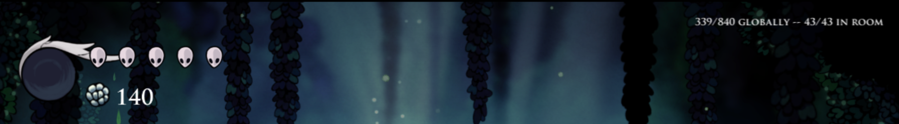

# GrassBag

GrassBag is a Hollow Knight mod that tracks how much grass you've mowed and leads you to more grass to mow.

Note: Team Cherry has confirmed that mowing all the grass in Hollow Knight is the only way to get the true ending in Silksong.

## Status Text

You'll see four numbers appear on the top right of your screen. One pair of numbers for your "global" progress and one pair for your "in room" progress.

For example, you might see: **32/88 globally -- 11/13 in room**. In this example: you've mowed **32** grass out of the **88** grass you've ever been in the same room (in this save file); and you've mowed **11** grass out of the **13** grass in the room/level/scene you're currently in.

Note that you only get credit for mowing a piece of grass once. You can't mow it, let it regrow, and then come back and mow it again for more points. You gotta find greener pastures.

## Grassward Compass

You'll also see a small green dot that hovers around your knight. It will always point at the nearest grass that you haven't mowed yet (unless you've mowed all the grass in the room you're in of course!).

## Uncuttable Grass

Some of the grass in the game cannot be cut (or at least, cannot be cut reliably) because it's meant to be far into the foreground or background. The mod is able to ignore most of the foreground/background grass automatically but some grass is very sneaky.

As an escape-hatch of sorts the mod will mark any grass that you slash with your nail as "mowed", even if it doesn't actually get cut. So remember to use your nail for any stubborn grass you come across, c-dash won't always cut it for this sneaky grass!

Another modder is working on a grass tracking mod that uses a built-in list of all the cuttable grass, so this won't be an issue once they've finished that.

## AllGrass.txt: Seeding the Global Total

The "global" total only increases when you enter a room with grass in it. The mod isn't aware of all the grass in the game right off the bat. But it can be!

If you visit every room with grass in it with this mod, then when you save your game an `AllGrass.txt` file will be created/overwritten in your save game directory (ex: mine is in `C:\Users\John\AppData\LocalLow\Team Cherry\Hollow Knight`). This file will have a line for every unique piece of grass you've found.

When you create a new game, the mod will check this file and seed the "global" total with all the grass in this `AllGrass.txt` file. The mod only reads from this file when you create a new game, so you can delete/muck-with this file without messing up your existing saves.

## Installing

1. Install the Modding API and the ModCommon mod. You can install both of these with the [Hollow Knight Mod Installer](https://www.nexusmods.com/hollowknight/mods/9).
2. Grab the latest release of GrassBag from https://github.com/itsjohncs/GrassBag/releases (it'll be a zip file with a copy of this readme in it as well as a `GrassBag.dll` file).
3. Copy that `GrassBag.dll` file that's inside that zip file it into your `Mods\` directory alongside your other mods (ex: on my computer the directory is at `C:\Program Files (x86)\Steam\steamapps\common\Hollow Knight\hollow_knight_Data\Managed\Mods`).
4. You're done! When you load up Hollow Knight you should see **GrassBag** followed by some numbers on the top left of your screen. Enjoy being the lawnmower you always wanted to be.

## Issues

If you find problems, open up an issue in https://github.com/itsjohncs/GrassBag/issues or reach out to me on Discord (johncs#8921).